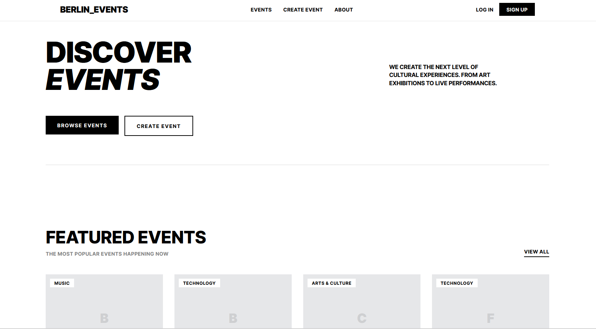

# Events Berlin

A curated platform to discover, book, and manage events happening in Berlin — built with a Rails API backend and a Next.js frontend.



## Overview

Events Berlin is a full-stack Eventbrite-style application featuring event discovery, ticketing, Stripe-powered payments, and an admin dashboard. The backend is a Ruby on Rails 7.1 JSON API and the frontend is a Next.js 15 app with React 19 and TailwindCSS.

## Features

- **Event Management** — Create, update, and manage events with categories, venues, and image uploads
- **User Roles** — Attendee, Organizer, and Admin roles with Pundit authorization policies
- **Ticketing** — Multiple ticket types per event with quantity and capacity tracking
- **Booking & Payments** — Complete booking flow with Stripe Checkout integration
- **Search & Filtering** — Filter events by category, location, date range, and keyword search
- **Admin Panel** — ActiveAdmin dashboard for managing users, events, bookings, categories, and venues
- **Background Jobs** — Sidekiq for async tasks (booking confirmations)
- **RESTful API** — JSON API with ActiveModel Serializers, consumed by the Next.js frontend

## Tech Stack

| Layer | Technology |
|-------|------------|
| **Backend** | Ruby 3.2.2, Rails 7.1 |
| **Frontend** | Next.js 15, React 19, TypeScript, TailwindCSS 4 |
| **Database** | PostgreSQL 12 |
| **Authentication** | Devise |
| **Authorization** | Pundit |
| **Payments** | Stripe Checkout + Webhooks |
| **Background Jobs** | Sidekiq + Redis |
| **File Uploads** | Active Storage |
| **Data Fetching** | Axios, TanStack React Query |
| **Admin** | ActiveAdmin |
| **CI** | GitHub Actions (RuboCop, Brakeman) |
| **Containerization** | Docker & Docker Compose |

## Getting Started

### Prerequisites

- Docker and Docker Compose

### Quick Start (Docker)

1. Clone the repository:
```bash
git clone https://github.com/Kevspecial/Events_berlin.git
cd Events_berlin
```

2. Copy the example env file and add your keys:
```bash
cp .env.example .env
```

3. Start all services:
```bash
docker compose up --build
```

4. In a separate terminal, set up the database:
```bash
docker compose exec web rails db:create db:migrate db:seed
```

The app will be available at:
- **Frontend**: http://localhost:3001
- **Rails API**: http://localhost:3000
- **Admin Panel**: http://localhost:3000/admin

### Manual Setup (without Docker)

1. Install dependencies:
```bash
bundle install
cd frontend && npm install && cd ..
```

2. Set up the database:
```bash
rails db:create db:migrate db:seed
```

3. Start the Rails server:
```bash
rails server
```

4. Start the frontend (in a separate terminal):
```bash
cd frontend
npm run dev
```

5. (Optional) Start Sidekiq:
```bash
bundle exec sidekiq
```

### Environment Variables

| Variable | Description |
|----------|-------------|
| `DATABASE_URL` | PostgreSQL connection string |
| `REDIS_URL` | Redis URL for Sidekiq and ActionCable |
| `STRIPE_SECRET_KEY` | Stripe secret API key |
| `STRIPE_WEBHOOK_SECRET` | Stripe webhook signing secret |
| `FRONTEND_URL` | Frontend URL for Stripe redirect URLs |
| `CORS_ORIGINS` | Comma-separated allowed origins |
| `NEXT_PUBLIC_API_URL` | API URL used by the frontend |
| `NEXT_PUBLIC_STRIPE_PUBLISHABLE_KEY` | Stripe publishable key for the frontend |

## Project Structure

```
Events_berlin/
├── app/                    # Rails application
│   ├── admin/              # ActiveAdmin resources
│   ├── controllers/api/v1/ # API controllers
│   ├── models/             # ActiveRecord models
│   ├── policies/           # Pundit authorization policies
│   ├── serializers/        # API response serializers
│   ├── services/           # Service objects (booking, payment)
│   └── jobs/               # Sidekiq background jobs
├── frontend/               # Next.js application
│   └── src/
│       ├── app/            # Next.js pages (App Router)
│       ├── components/     # React components
│       ├── lib/            # API client, config, Stripe
│       ├── services/       # Frontend service layer
│       └── types/          # TypeScript type definitions
├── config/                 # Rails configuration
├── db/                     # Migrations and schema
├── documentation/          # Project documentation
├── docker-compose.yml      # Docker services
└── Dockerfile              # Rails container
```

## API Endpoints

| Method | Endpoint | Description |
|--------|----------|-------------|
| `POST` | `/api/v1/signup` | Register a new user |
| `POST` | `/api/v1/login` | Sign in |
| `DELETE` | `/api/v1/logout` | Sign out |
| `GET` | `/api/v1/events` | List events (with filters) |
| `GET` | `/api/v1/events/:id` | Event details |
| `POST` | `/api/v1/events` | Create event (organizer/admin) |
| `POST` | `/api/v1/events/:id/bookings` | Book tickets |
| `GET` | `/api/v1/bookings` | User's bookings |
| `PATCH` | `/api/v1/bookings/:id/cancel` | Cancel booking |
| `POST` | `/api/v1/checkout/sessions` | Create Stripe checkout |
| `POST` | `/api/v1/checkout/webhook` | Stripe webhook handler |
| `GET` | `/api/v1/users/profile` | Current user profile |

See [documentation/API_DOCUMENTATION.md](documentation/API_DOCUMENTATION.md) for full details.

## Database Schema

### Core Models

- **User** — Roles: attendee, organizer, admin. Devise authentication
- **Event** — Belongs to creator, category, venue. Has image, ticket types, and bookings
- **Category** — Event categorization (unique name)
- **Venue** — Locations with address, city, and capacity
- **TicketType** — Ticket tiers per event with price and quantity
- **Booking** — Links user, event, and ticket type. Tracks status (`pending` / `confirmed` / `cancelled`) and payment status (`unpaid` / `paid` / `failed` / `refunded`)

## Testing

```bash
# Run tests
rails test

# Run linter
bin/rubocop

# Run security scan
bin/brakeman

# Run bundler audit
bundle exec bundler-audit check --update
```

## Documentation

- [API Documentation](documentation/API_DOCUMENTATION.md)
- [Security & Production Readiness](documentation/SECURITY.md)
- [Implementation Summary](documentation/IMPLEMENTATION_SUMMARY.md)

## Contributing

1. Fork the repository
2. Create your feature branch (`git checkout -b feature/amazing-feature`)
3. Commit your changes (`git commit -m 'Add some amazing feature'`)
4. Push to the branch (`git push origin feature/amazing-feature`)
5. Open a Pull Request

## License

This project is open source and available under the MIT License.
